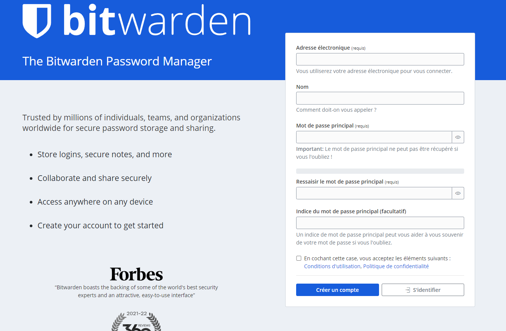

# h5_Uryyb-Greb

## Schneier 2015: Applied Cryptography

### 10.1 CHOOSING AN ALGORITHM

- Choosing an algorithm is a delicate matter where zero risk is not guaranteed.

- Choosing a published or open source algorithm offers you a "guarantee" that the algorithm has been reviewed and evaluated by other users and cryptographers. In addition, open source gives you access to the entire source code. This allows you to analyse the algorithm and possibly modify it (if the licence allows) to best suit your needs.

- Choosing an algorithm based on the reputation of a company is absolutely no guarantee of security. The same is true of hiring a security consultant. In both cases you may be dealing with entities with limited or no knowledge of cryptography.  

- Trusting your government is one of the least viable solutions. Governments are generally not as well developed in this area as private organisations. This is due to a lack of investment. In addition, state organisations such as the NSA prefer to keep their knowledge for their own use.

- Writing and using your own algorithm can be a solution. However, by doing so you leave the door wide open to potential security flaws. Because your solution has not been tested by other specialists in the field, it will only be tested in the scenario in which you created it.

- Government agencies such as the FBI or NAS prefer to keep their ability to crack an algorithm secret, rather than show information they have obtained by cracking the algorithm used by the suspect.

- As in World War II, the Allies forbade the use of German Ultra traffic, so as not to show the Germans that they had broken their encryption. The only exception was if the Allies could prove that they had found the information by some other credible means.

- The only way to prove that the NSA can break an algorithm is to encrypt information so important that its release is worth proving that the NSA can break the algorithm.

- As the author says in his book, "**A good working assumption is that the NSA can read any message that it chooses, but that it cannot read all messages that it chooses**".

- Any algorithms exported from the US must be approved by the US government.

- It is accepted that alogorithms validated by the US government can be broken by the NSA.

- The NSA holds all source code for algorithms approved by the government for export.

### 10.2 PUBLIC-KEY CRYPTOGRAPHY VERSUS SYMMETRIC CRYPTOGRAPHY

- Public key cryptography and symmetric cryptography cannot be compared, as they are different and solve different problems. 

- For data encryption, the use of cryptography is the best solution. It is faster and is not subject to the risk of cipher text attacks. 

- Public key cryptography can be used for key management and a large number of protocols, which symmetric cryptography cannot be used for. 

### 10.3 ENCRYPTING COMMUNICATIONS CHANNELS

- Data encryption can take place in any layer of the OSI communication model.

- In practice, encryption takes place in the lowest layers, layers 1 and 2, i.e. in the highest layers. In the lowest layers, we speak of link-by-link encryption. For the higher layers, we speak of end-to-end encryption.

#### Link-by-Link Encryption

- This type of encryption is implemented in the physical layer of the network. This is because this is the simplest place to implement it, due to the standardisation of interfaces and ease of connection with hardware encryption devices.

- Link-by-link encryption is very effective, as it will encrypt all data, routing information and protocol information that passes through it.

- This type of encryption is called **traffic-flow security**. 

- An adversary facing this type of encryption will not be able to access the information, but neither will he be able to determine the location and amount of data circulating on the network.

- However, for this solution to work, every physical link in the network must be protected. 

- Having a large network can also be a barrier to implementing this solution, as it quickly becomes very expensive.

#### End-to-End Encryption

- End-to-end encryption will selectively and permanently encrypt data until the recipient receives it.

- The encryption equipment is placed between the network layer and the transport layer.

- End-to-end encryption avoids encryption and decryption at the physical layer.

- The routing information is not encrypted. This allows it to be analysed.

- The encryption operation can be made transparent to the user and only one set of keys per link is required.

- The implementation of end-to-end encryption equipment can be complicated due to the specific protocols of each communication system. 

- An alternative would be to perform the encryption at higher layers of the communication architecture, but this can also cause compatibility problems.

#### Combining the Two

- With the combination of both approaches a higher level of security is achieved.

- All physical links are encrypted. This prevents any exposure of the data to intermediate nodes and also any analysis of the traffic.

- In order to simplify key management, the load can be shared for both systems.

- However, this approach is the most expensive because of the need to implement both encryption systems.

### 10.4 ENCRYPTING DATA FOR STORAGE

- The Alice and Bob model can also be applied to data encryption, but the problem is fundamentally different in the context of data storage.

- Messages in transit through communication channels can be resent if necessary, but if data encrypted for storage is lost, it is lost forever. Encryption applications for data storage must therefore have mechanisms to avoid unrecoverable errors.

- the encryption key is smaller than the message. 

- Key management and retention procedures must take into account that keys can be used repeatedly over many years to access encrypted data at any time.

- There is a risk that the encrypted data will be available in clear text on another computer, making encryption useless. 

- Care should be taken to ensure that the unencrypted file is deleted after encryption. 

## Sources

[learning.oreilly.com](https://learning.oreilly.com/library/view/applied-cryptography-protocols/9781119096726/19_chap10.html)

---

## Password Manager

### Bitwarden

**Bitwarden** is a free and open source password manager. It allows you to generate, store and manage your logins and passwords. It also allows you to manage your credit card information and other sensitive data.

Being cloud-based, it allows you to access your information regardless of your location. You can access the service using their applications, websites or by installing the extension on your browser. This tool is compatible with **Windows**, **macOS**, **Linux**, **IOS** and **Android**. As mentioned above, it can be used as an extension to your web browser such as **Google Chrome**, **Firefox** and **Microsoft Edge**.

### What treaths does it protect against?

Bitwarden provides several features that improve the security of your data by securing the storage of your login and passwords.

- The passwords generation feature allows to create weak passwords and avoids the user to use a single password for several accounts. Bitwarden can generate passwords from 5 to 128 characters and using all character sets.

- The automatic filling feature when logging into your different accounts prevents keylogging attacks.

- Bitwarden offers you the possibility to check if your passwords have been exposed. It can also generate a report of exposed passwords.

- Bitwarden can also generate a report with all the websites that it considers insecure. Any website that does not use TLS/SSL encryption is considered insecure.

- With Bitwarden you can implement two-factor login which allows for enhanced security when logging into the manager. 

### What information is encrypted, what's not?

Bitwarden uses end-to-end encryption for all data in the user's area they call the safe. Only the user's email and password can decrypt the data in the vault. The data is encrypted before it even leaves the user's device. The Bitwarden team only stores encrypted data. They use AES-CBC 256-bit for the data in the safe and PBKDF2 SHA-256 or Argon2 to derive the user's encryption key.

### What's the license? How would you describe license's effects or categorize it?

Bitwarden is an open source password manager developed by 8 bits Solutions LLC and released in 2015 under the GNU GPLv3 license.

The GNU GPL v3 license allows someone to take the source code and make changes to it and then distribute your version. But in return, your version will also be subject to the same licensing requirements. In other words, your version will also have to be licensed under the GNU GPLv3.

### Where is the data stored? If in "the cloud", which country / juristiction / which companies? If on local disk, where?

Bitwarden uses a cloud infrastructure for the storage of these users' data. The data is stored at Microsoft Azure in the US. The fact that the data is stored by US companies means that they are subject to the US Cloud Ac policy, which allows the US government in the course of an investigation to be able to access the company's data. However, since Bitwarden is open source, you can host it yourself. 

The data that is stored on your local devices is encrypted and remains encrypted until you connect to the service. The decrypted data is only stored in memory and is never permanently written to a medium. 

As shown on the [Bitwarden](https://bitwarden.com/help/data-storage/), the data is stored at these locations on your local machine : 

- Windows

  - Standard installation: %AppData%\Bitwarden

  - Microsoft Store installation: %LocalAppData%\Packages\8bitSolutionsLLC.bitwardendesktop_h4e712dmw3xyy\LocalCache\Roaming\Bitwarden

  - Portable: .\bitwarden-appdata
  
- macOS

  - Standard installations: ~/Library/Application Support/Bitwarden

  - Mac App Store: ~/Library/Containers/com.bitwarden.desktop/Data/Library/Application Support/Bitwarden

- Linux

  - Standard installations: ~/.config/Bitwarden

  - Snap: ~/snap/bitwarden/current/.config/Bitwarden

### How is the data protected?

As explained above, all user data in the vault is encrypted using AES-CBC 256-bit encryption. The manager access passwords are salted and hashed with the user's local email address before being sent to the Bitwarden server. When the hashed password arrives at the Bitwarden servers, it is re-salted with a cryptographically secure random value and then re-hashed and finally stored.

## Sources

[bitwarden.com](https://bitwarden.com/)

[bitwarden.com - data storage](https://bitwarden.com/help/data-storage/)

[bitwarden.com - what encryption is used](https://bitwarden.com/help/what-encryption-is-used/)

[uk.pcmag.com](https://uk.pcmag.com/password-managers/121377/bitwarden)

--------

## Demonstrate the use of a password manager

In this part I will continue with the Bitwarden password manager. I will show you how to use it. I would like to apologize for the fact that some of the images will be in French because Bitwarden sets the language according to the language of the system.

1. To start you need to create an account on the official Bitwarden page. 

2. You have several possibilities to access your password manager : 

  - the first is through the Bitwarden web page. Simply log in and the site will redirect you to your password manager.
  
  
  
  - the second option is to download the application to your device (computer, phone). 
  
  
  
  
  
  - Finally the third option is to download the extension for your web browser. In my case I use **Brave** so I downloaded the extension for this browser.
  
  
  
3. Once you have chosen the option that suits you best, you can click on the **+** to add a new identifier. 

This will allow you to enter a name to the new set of credentials, as well as your username (which can be automatically generated by Bitwarden) and generate the password automatically. In my case, the password is 50 characters long, but this can be changed at the time of generation.

You just have to click on **options**. The options also allow you to integrate or not different characters to your password. 

Finally, you have to put the URI of the website. If you use the browser extension, the **Name** and **URI** fields will be filled in automatically.

Bitwarden offers you the possibility to check if your password has not been compromised by clicking on the **vue** logo.

4.Now you can try out your password manager by going to the website that hosts the account for which you created your credentials. In this example, I have created credentials for my Gmail account.

## Sources

[bitwarden.com](https://bitwarden.com/)

------ 

## Encrypt and decrypt a message

In this section, I will show you how to encrypt and decrypt a message between two users. For the purpose of this exercise, I have created a second user on my system. 

> To create a new user in your system you can run the following command :

    $ sudo adduser [username of the new user] 
    
Then I created a group with the new user, so that only members of the group could access our key and message exchange. Creating a group allows better management of permissions and avoids forgetting to remove access to a user who no longer has access to certain files or directories.

> To create a group and add users, you can run the following commands :

    $ addgroup [name of the group]
    $ adduser [username] [group]
    
In order to share the information between myself and the new user, I created a new directory in my **Public/** directory which I called **exkeys/**. I set the group I created as the owner of the directory, so that only users in the group can access it. 

> To create a new directory, you can run the following command : 

   $ mkdir [name of the directory]
   
> To change the permissions and owner of an element, you can run the following commands : 

   $ chmod [permissions] [element] # change permissions 
   $ chown [new owner] [element] # change owner

As a result, I created our own directory in the **exkeys/** directory, which I called **keys/**. 

### Création des clés

For the creation of my key and that of the other user, I used **gpg**. In order to encrypt the messages and then decrypt them, we need both the recipient's public key and my own. Because if I encrypt the message with my key, I will be the only person who can decrypt it because I am the only person who knows my private key. 

> To create your jpg key, you can run the following command : 

    $ gpg --generate-key 
    
 > to see your key, you can run the following command :
 
    $ gpg --fingerprint
    
After creating the keys for the recipient and myself, I copied my public key and the recipient's key into two different files and moved them into the **keys** directory I mentioned earlier.
  
> To generate a file with your public key, you can run the following command : 

    $ gpg --armor > [filname]
    
> To move a file, such as the file containing your public key, to another directory. You can run the following command :

    $ mv [file] [destination]
    
Finally, when I logged into the different account, I imported the public keys in preparation for decrypting the messages. I imported the recipient's key and the recipient imported my key. 

> To import another user's public key, you can run the following command : 

    $ gpg --import [file with key]
    
### Encryption et Décrytion d'un message

Now that I have the recipient's public key and he has mine. I can now create my message by encrypting it with **his public key** and move the encrypted message to the common **exkeys/** directory.

> To create a text file and encrypt the same file, you can run the following commands : 

    $ nano [filename]
    $ gpg --encrypt --recipient [mail adress of the recipient] --sign --armor [filename]
    
Finally, after encrypting the message and putting it in the directory, I decrypted the message the other user sent me. I also decrypted my message by logging into the recipient's account to check that it was working properly.

> To decrypt and read a file sent to you. You can run the following commands :

    $ gpg decrypt [file with the message] > [file] # this comand allows you to decrypt and copy all the content into a new file
    $ cat [file with all the decrypted content]

