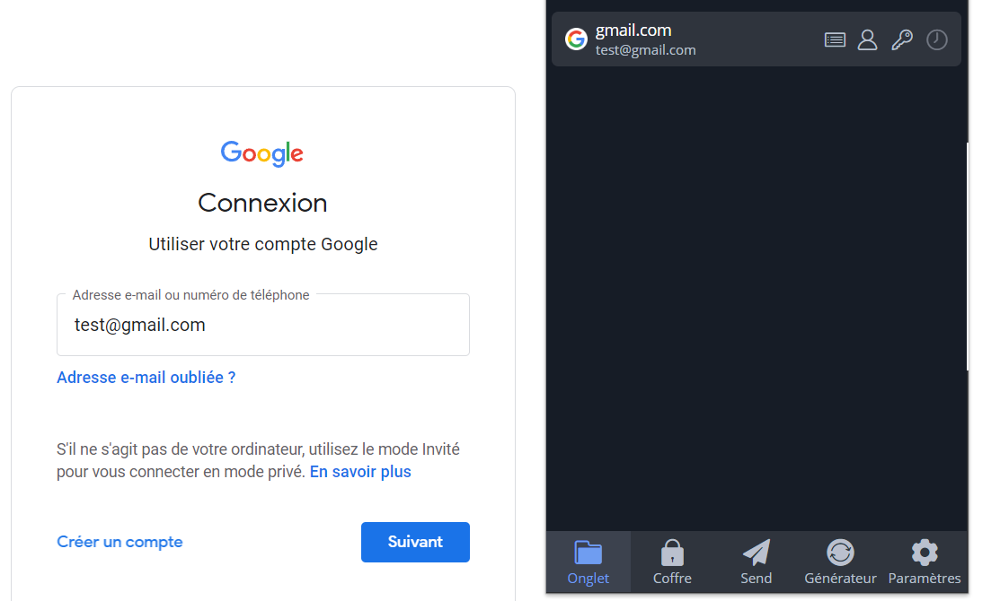

# h5_Uryyb-Greb

## Schneier 2015: Applied Cryptography

### 10.1 CHOOSING AN ALGORITHM

- Le choix d'un algorithme est une chose délicate où le risque zéro n'est pas grantie.

- Choisir un algorithme publié ou open source, vous offre "une garantie" que l'algorithme a pu être examiné et évaluer par d'autres utilisateurs et cryptographes. De plus, l'open source vous donne l'accès à l'enssemble du code source.Ce qui vous permet d'effectuer une analyse de l'algorithme et d'éventuellement le modifier (si la licence le permet) afin qu'il corresponde au mieux à vos besoins.

- Choisir un algorithme par rapport la réputation d'une entreprise, n'est absolument pas un gage de sécurité. Au même titre que faire appel à un consultant en sécurité. Dans les deux cas vous pouvez avoir affaire à des entités avec des connaissances limitées, voire inexistantes dans le domaine de la cryptography.  

- Faire confiance à son gouvernement fait partie des solutions les moins viables. Les gouvernements n'ont généralement aussi développé dans le domaine que les organisations privées. Cela étant dû à un manque d'investissements. De plus, des organisations étatiques comme la NSA préfèrent garder leurs connaissances pour leurs usages.

- Écrire et utiliser votre propre algorithme peuvent être une solution. Cependant, en faisant cela vous laissez la porte grande ouverte à des potentielles failles de sécuriser. Car votre solution n'a pas été tester par d'autres spécialistes dans le domaine et donc elle sera testée que dans le cas de figure dans lequel vous l'avez créé.

- Des organismes gouvernemental comme le FBI ou la NAS préfére garder secret leur capacité à cracker un algorithme, plutôt que de montrer des informarions qu'il aurais obtenu en crackant l'algorithme utilisé par le suspect.

- Comme lors de la seconde guerre mondial, les alliés interdisait l'utilisation du German Ultra traffic, afin de ne pas montrer aux Allemands qu'ils avaient cassé leur cryptage. La seule exception était si les alliés pouvait prouvé qu'ils ont trouvé les information par un autre moyen crédible.

- Le seul moyen de prouver que la NSA peut casser un algorithme est de crypter un information si importante que sa diffusion mérite de prouvé que la NSA peut venir à bout de l'alogorithme.

- Comme le dit l'auteur dans son livre, "**A good working assumption is that the NSA can read any message that it chooses, but that it cannot read all messages that it chooses.**".

- Tout algorithmes exportés hors des Etats-Unis doivent être approuvés par le gouvernement américain.

- Il est admis que les alogorithm validé par le gouvernemennt américain, peuvent être cassé par la NSA.

- La NSA détient tous les codes sources des algorithms approuvé par le gouvernement pour l'exportation.

### 10.2 PUBLIC-KEY CRYPTOGRAPHY VERSUS SYMMETRIC CRYPTOGRAPHY

- La cryptographie à clé publique et la cryptographie symétrique ne peuvent pas être comparé, car elles sont différente et résolvent des problèmes différents. 

- Pour le cryptage de données, l'utilisation de la cryptographie est la meilleurs solution. Elle est plus rapide et n'est pas soumise au risque des attaque par choix de texte chiffré. 

- La cryptographie à clé publique peut être utilisé pour la gestion des clés et un grand nombre de protocole, chose pour laquel la cryptographie symétique ne peut pas être utilisé. 

### 10.3 ENCRYPTING COMMUNICATIONS CHANNELS

- Le cryptage des données peut intervenir dans n'importe quelle couche du model de communication OSI.

- En pratique le cryptage à lieu dans les couches le plus basse, les couches 1 et 2, soit dans les couches les plus haute. Dans les couches les plus basse, on va parler de link-by-link encryption. Pour les couches supérieurs, on parle alors de end-to-end encryption.

#### Link-by-Link Encryption

- Ce type de cryptage est mis en place dans la couche physique du réseau. Cela est dû au fait que c'est l'endroit le plus simple pour le mettre en place, grâce à la nomalisation des interrfaces et à facilité de connection avec des dispositifs de chiffrement matériel.

- L'encryption link-by-link est très efficace, car il va encrypter toutes les données, les information de routage et les informations protocolaires qui passent par lui.

- Ce type de cryptage est appelé **traffic-flow security**. 

- Un adversaire face à ce type de cryptage ne pourra pas acceder à l'information mais il ne pourra également pas l'endroit et la quantité des données en circulation sur le réseau.

- Cependant, pour que cette solution fonctionne il faut que chaque lien physique du réseau doivent être protéger. 

- Le fait de possèder un gros réseau peut également mettre un frein à la mise en place de cette solution, car elle devient très vite très coûteuse.

#### End-to-End Encryption

- L'encryption end-to-end va crypter des données de manière sélective et premanante, jusqu'à ce que le destinataire les reçoivents.

- L'équipement de cryptage est placé entre la couche réseau et la couche transport.

- L'encryption end-to-end permet d'éviter le cryptage et décryptage au niveau de la couche physique.

- les information d'achminement ne sont pas cryptés. Ce qui permet de les analyser.

- L'opération de cryptage peu être rendue transparante pour l'utilisateur et un seul jue de clé par liaison suffi.

- La mis en place d'un équipement de cryptage end-to-end peut être compliqé en raison des protocoles spécifique à chaque système de communication. 

- Une alternative serait d'effectuer le cryptage à des couches supérieurs de l'architecture de communication, mais cela peut également poser des problème en terme de compatibilité.

#### Combining the Two

- Avec la combinaison des deux approche on obtient un niveau de sécurité plus élevé.

- Tout les liens physique sont crypté. Cela empèche toutes exposition des données aux noeuds intermédaire et également toute analyse du trafic. 

- Afin de simplifier la gestion des clés, la charge peut être répartie pour les deux systèmes.

- Cependant, cette approche est la plus coûteuse en raison de la nécessité de mettre en œuvre les deux systèmes de cryptage.

### 10.4 ENCRYPTING DATA FOR STORAGE

- le modèle Alice et Bob peut également être appliqué au chiffrement de données, mais le problème est fondamentalement différent dans le cadre du stockage de données.

- Les messages en transit dans les canaux de communication peuvent être renvoyés si nécessaire, mais si les données cryptées pour le stockage sont perdues, elles sont perdues à jamais. Les applications de chiffrement pour le stockage de données doivent donc disposer de mécanismes pour éviter les erreurs irrécupérables.

- la clé de chiffrement est plus petite que le message. 

- Les procédures de gestion et de conservation des clés doivent tenir compte du fait qu'elle peutvent être utilisées à plusieurs reprises pendant plusieurs années pour accèder à des données cryptées à n'importe quel moment. les clés doivent donc être conservées pendant longtemps et doivent être stockées en toute sécurité.

- Il existe un risque que les données crytées soit disponible en claire sur un autre ordinateur, se qui rend le cryptage inutile. 

- Il faut s'assurer que le fichier non crypté est effacé après son cryptage. 

## Sources

[learning.oreilly.com](https://learning.oreilly.com/library/view/applied-cryptography-protocols/9781119096726/19_chap10.html)

---

## Password Manager

### Bitwarden

**Bitwarden** est un gestionnaire de mots de passe gratuit et open source. Il vous permet de genérer, stocker et gérer vos identifiants et mots de passes. Il vous permet également de gérer les information de vos cartes de crédit et autre données sensible. 

Etant basé sur le cloud, il vous permet ainsi d'avoir accès à vos inforamtions peut importe votre localisation. Vous pouvez accèder au service en utilisant leurs application, leurs site internet ou en installant l'extention sur votre navigateur. Cette outil est compatible **Windows**, **macOS**, **Linux**, **IOS** et **Android**. Comme indiqué ci-dessus, il peut être utilisé comme extention de votre navigateur web comme **Google Chrome**, **Firefox** et **Microsoft Edge**.

### What treaths does it protect against?

Bitwarden fournit plusieurs fonctionnalitées qui permettent d'améliorer la sécurité de vos données par la sécurisation du stockage de vos identifiants et passwords.

- La fonctionnalité de génération de passwords permet de créer des passwords faible et évite à l'utilisateur d'utiliser un seul password pour plusieurs comptes. Bitwarden peut générer des mot de passe de 5 à 128 caractères et en utilisant tous les jeux de caractères.

- La fonctionnalité automatic filling lors de vos connections à vos différents comptes, empêche les attaques de type keylogging.

- Bitwarden vous offre la possibilité de controler si vos passwords ont été exposé. Il peut également générer un raport des mots de passe exposés.

- Bitwarden peut également produire un rapport avec tout les site internet qu'il ne juge pas sécurisé. Tout site internet n'utilisant pas le cryptage TLS/SSL est considérer comme non sécurisé.

- Avec Bitwarden vous pouvez mettre en place la connection à double facteur qui permet le renforcement de la sécurité lors de la connection au gestionnaire. 

### What information is encrypted, what's not?

Bitwarden utilise un chiffrement de bout en bout pour toutes les données de la zone de l'utilsateur qu'ils appelent le coffre-fort. Seul l'e-mail et le mot de passe de l'utilisateur peuvent déchiffrer les données contenu dans le coffre-fort. Les donneés sont cryptées avant même de quitter l'appareil de l'utilisateur. L'equipe de Bitwarden ne stock que des données chiffrée. 
Ils utilisent AES-CBC 256-bit pour les données contenu dans le coffre-fort et PBKDF2 SHA-256 ou Argon2 pour dériver la clé de chiffrement de l'utilisateur.

### What's the license? How would you describe license's effects or categorize it?

Bitwarden est un gestionnaire de mot de passe open source dévelopé par 8bit Solutions LLC et mis en circulation en 2015 sous la licence GNU GPLv3.

La licence GNU GPL v3 permet à une personne de prendre le code source et d'y apporter des modification puis de distribuer votre version. Mais en contre partie, votre version sera également soumise aux mêmes exigences de licence. En d'autre terme, votre version devra également être sous lincence GNU GPLv3.

### Where is the data stored? If in "the cloud", which country / juristiction / which companies? If on local disk, where?

Bitwarden utilise un infrasturcture cloud pour le stockage de données de ces utilisateurs. Les données sont stocké chez Microsoft Azure aux États-Unis. Le fait que les données sont conservée par des entreprise américaine, ces dernières sont soumise à la politique du US Cloud Ac, qui permet au gouvernement américain dans le cadre d'une enquête à pouvoir accèder aux données de l'entreprise. Cependant, Bitwarden étant un logiciel open source, cela vous permet de l'héberger vous même. 

Concernant les données qui sont stockées sur vos appareils en local, elles sont cryptées et le reste jusqu'à votre connection au service. Les données décryptées sont uniquement sotcké en mémoire et ne sont jamais écrite sur un support de manière permanente. 

Comme le montre le site internet de [Bitwarden](https://bitwarden.com/help/data-storage/), les données sont stocké à ces emplacement sur votre machine local : 

- Windows

  - Standard installation: %AppData%\Bitwarden

  - Microsoft Store installation: %LocalAppData%\Packages\8bitSolutionsLLC.bitwardendesktop_h4e712dmw3xyy\LocalCache\Roaming\Bitwarden

  - Portable: .\bitwarden-appdata
  
- macOS

  - Standard installations: ~/Library/Application Support/Bitwarden

  - Mac App Store: ~/Library/Containers/com.bitwarden.desktop/Data/Library/Application Support/Bitwarden

- Linux

  - Standard installations: ~/.config/Bitwarden

  - Snap: ~/snap/bitwarden/current/.config/Bitwarden

### How is the data protected?

Comme expliqué ci-dessus, toutes les données du vault data de l'utilisateur sont crypter en utilisant l'encryptage AES-CBC 256-bit. Le mots de passe d'accès au gestionnaire est salts et hashes avec l'adresse mail de l'utilisateur en local avant l'envoie au server de Bitwarden. Quand le mot de passe hashed arrive dans les servers de Bitwarden, il est denouveau salé avec une cryptographically secure random value et il est ensuite denouveau hashed et finalement stocké.

## Sources

[bitwarden.com](https://bitwarden.com/)

[bitwarden.com - data storage](https://bitwarden.com/help/data-storage/)

[bitwarden.com - what encryption is used](https://bitwarden.com/help/what-encryption-is-used/)

[uk.pcmag.com](https://uk.pcmag.com/password-managers/121377/bitwarden)

--------

## Demonstrate the use of a password manager

Dans cette partie je vais continuer avec le gestionnaire de mot de passe Bitwarden. Je vais vous montrer comment l'utiliser. Je tiens à m'excuser certaines images seront en français car Bitwarden établie la langue en fonction de la langue du system.

1. Pour commencer il vous faut créer un compte sur la page officiel de Bitwarden. 

2. Vous avez plusieur possibilité pour accéder à votre gestionnaire de mot de passe : 
  - la première est à travers la page internet de Bitwarden. Il vous suffit de vous connecter et le site va vous rediriger vers votre gestionnaire de mot de passe.
  
  
  
  - la seconde option est de télécharger l'application sur votre appareil (oridnateur, téléphone). 
  
  
  
  
  
  - Finalment la troisième option est de télécharger l'extention pour votre navigateur internet. Dans mon cas j'utilise **Brave** donc j'ai télécharger l'extention pour ce navigateur.
  
  
  
3. Après avoir choisi le moyen l'option qui vous convient le plus, vous pouver cliquer sur l'incone **+** pour ajouter un nouvel identifiant. 

Cela va vous permettre d'entrer un nom au nouvel ensemble d'identifiant,  ainsi que votre nom d'utilisateur (qui peut être générer automatiquement par Bitwarden) et générer le mot de passe automatiquement. Dans mon cas, le mot de passe fait 50 caratères, mais cela peut être modifier au moment de la génération. 

Il vous suffit juste de cliqué sur **options**. Les options vous permettes également de intégrer ou pas différents caractères à votre mot de passe. 

Finalement, il vous reste à mettre l'URI du site internet. Si vous utilisé l'extention du navigateur, les champs **Nom** et **URI** seront automatiquement remplis.

Bitwarden vous offre la possibilité de vérifier si votre mot de passe n'a pas été compromis en cliquant sur le logo en forme de **vue**.

4. Maintenant, vous pouvez essayer votre gestionaire de mot de passe en vous rendant sur le site internet qui heberge le compte pour lequel vous avez créé vos identifaint. Dans cette exemple, j'ai créé des identifiants pour mon compte Gmail.

## Sources

[bitwarden.com](https://bitwarden.com/)

------ 

## Encrypt and decrypt a message

Dans cette partie, je vais vous montrer comme encrypter et decrypter une  message entre deux utilisateurs. Pour les besoins de cette exercice, j'ai créé une second utilisateur sur mon system. 

> Pour créer un nouvel utilisateur dans votre système vous pouvez exécuter la commande suivante :

    $ sudo adduser [username of the new user] 
    
Ensuite, j'ai créé un groupe avec le nouvel utilisateur, afin que seulement les membres du groupe puissent accèder à notre échange de clé et de message. La création d'un groupe permet une meilleur gestion des permission et permet d'éviter l'oublie de retirer les accès à un utilisateur qui n'a plus accès à certain fichier ou répertoir.

> Pour créer un groupe et ajouter des utilisateurs, vous pouvez exécuter les commandes suivante :

    $ addgroup [name of the group]
    $ adduser [username] [group]
    
Afin d'effectuer le partage des information entre moi et le nouvel utilisateur, j'ai créer un nouveau repertoir dans mon répertoir **Public/** que j'ai appelé **exkeys/**. J'ai mis le groupe que j'ai créer en tant que owner du répertoir, afin de permettre l'accès seulment aux utilisateur du groupe. 

> Pour créer un nouveau répertoir, vous pouvez exécuter la commande suivante : 

   $ mkdir [name of the directory]
   
> Pour changer les permissions et le owner d'un element, vous pouvez exécuter les commandes suivantes : 

   $ chmod [permissions] [element] # change permissions 
   $ chown [new owner] [element] # change owner

Suite à cela, j'ai créé un notre répertoir dans le répertoir **exkeys/**, que j'ai appeler **keys/**. 

### Création des clés

Pour la création de ma clé et celle de l'autre utilisateur, j'ai utilisé **gpg**. Pour permettre l'encryption des messages et par la suite leurs décryption, il nous faut à la fois pour moi la clé public du destinataire et vis-versa. Car si je crypte le message avec ma clé, je serais l'unique personne à pouvoir la décrypté car je suis l'unique personne à connaitre ma clé privée. 

> pour créer votre clé gpg, vous pouvez exectuter la commande suivante : 

    $ gpg --generate-key 
    
 > pour voir votre clé, vous pouvez éxécuter la commande suivante :
 
    $ gpg --fingerprint
    
Après  avoir créé les clés pour le destinataire et moi-même, j'ai copie ma clé public et celle du destinataire dans deux fichier différents et je les ai déplacer dans le répertoir **keys** que j'ai mentionné précedement.
  
> Pour générer un fichier avec votre clé public, vous pouvez éxécuter la commande suivante : 

    $ gpg --armor > [filname]
    
> Pour déplacer un fichier, comme par exemple le fichier contenant votre clé public, dans un autre répertoir. Vous pouvez éxécuter la commande suivante :

    $ mv [file] [destination]
    
Finalement en me connectant au différent compte, j'ai importé les clés public en prévision du decryptage des messages. J'ai importé la clé du destinataire et le destinataire a importé ma clé. 

> Pour importer la clé public d'un autre utilisateur, vous pouvez éxécuter la commande suivante : 

    $ gpg --import [file with key]
    
### Encryption et Décrytion d'un message

Maintenant que je suis en posséssion de la clé public du destinataire et lui de la mienne. Je peux maintenant créer mon message en le cryptant avec **ça clé public** et déplacer le message crypté dans le répertoir commun **exkeys/**.

> Pour la création d'un fichier texte et l'encryption de ce même fichier, vous pouvez éxécuter les commandes suivante : 

    $ nano [filename]
    $ gpg --encrypt --recipient [mail adress of the recipient] --sign --armor [filename]
    
Finalement, après avoir encrypté le message et l'avoir mis dans le répertoir, j'ai décrypté le message que l'autre utilisateur m'a envoyé. J'ai également décrypté mon message en me connectant au compte du destinataire pour vérifier le bon fonctionnement.

> Pour décrypter et lire un ficher qu'on vous à envoyer, vous pouvez éxécuter les commandes suivante :

    $ gpg decrypt [file with the message] > [file] # this comand allows you to decrypt and copy all the content into a new file
    $ cat [file with all the decrypted content]
